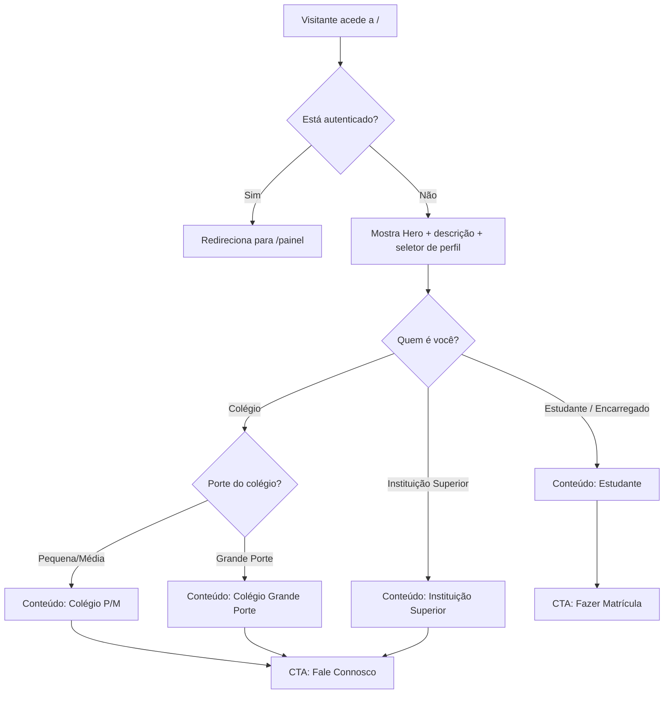

# Especificação de Design — Landing Page Pública do Spuri (`/`)

## 1. Visão Geral e Objetivo

A rota `/` deixa de ser o painel pós-login e passa a ser a **landing page pública** do Spuri — a montra da plataforma para quem ainda não é cliente. É, provavelmente, a peça de comunicação mais importante do produto: quem chega aqui decide, em poucos segundos, se o Spuri é relevante para si.

Esta especificação cobre os quatro pilares de conteúdo pedidos:

1. **Breve descrição da plataforma** — secção 6.2
2. **Funcionalidades/serviços** — secção 6.4
3. **Diferenciais** (o que nos torna únicos) — secção 6.5
4. **Problemas resolvidos e soluções reais**, adaptados a cada tipo de utilizador — secção 7

E resolve o requisito central: a página tem de **se adaptar a quem a visita**, perguntando logo à entrada "quem é você?" e ajustando proposta de valor, problemas resolvidos e chamada para ação em conformidade.

> Numa frase: uma landing page que se apresenta de forma diferente a um encarregado de educação, a um colégio pequeno, a um colégio de grande porte e a uma instituição de ensino superior — sem nunca parecer 4 páginas diferentes.

---

## 2. Alterações de Roteamento

Mudança de front-end — a aplicação já suporta todos os fluxos necessários (matrícula, login, pesquisa de instituições), por isso não há necessidade de descrever aqui nenhum detalhe de backend.

|Rota|Antes|Depois|Quem acede|
|---|---|---|---|
|`/`|Painel (pós-login)|**Landing page pública** (este documento)|Apenas **não autenticados**|
|`/painel`|(não existia)|Conteúdo que hoje vive em `/`|Apenas **autenticados**|

**Regras de guarda a implementar:**

- Utilizador **autenticado** que aceda a `/` → redirecionar para `/painel`.
- Utilizador **não autenticado** que aceda a `/painel` (ou outra rota protegida) → redirecionar para `/`.
- Botão **"Entrar"** no cabeçalho da landing → aponta para o fluxo de login já existente.
- Após login com sucesso (qualquer tipo de utilizador) → redirecionar sempre para `/painel`, salvo se já existir uma landing pós-login diferenciada por tipo de utilizador.

> **SEO:** `/` sendo pública, é o momento de adicionar título, meta descrição e Open Graph otimizados. `/painel` deve ficar `noindex`, por estar atrás de autenticação.

---

## 3. Fluxo de Navegação e Identificação do Utilizador

A página usa **divulgação progressiva**: mostra pouco de início e revela conteúdo à medida que o utilizador se identifica.



**Comportamento a implementar:**

- O seletor **nunca desaparece** — mesmo depois de escolher um perfil, os 3 botões continuam visíveis (o escolhido em estado "ativo"), para trocar de perfil sem recarregar a página.
- Só **Colégio** tem um segundo nível (Pequena/Média ou Grande Porte); Estudante e Instituição de Ensino Superior levam diretamente ao conteúdo do perfil.
- Ao escolher um perfil, o conteúdo dinâmico aparece logo abaixo do seletor, com scroll suave — nunca em modal/popup.
- Guardar a escolha num parâmetro de URL (ex.: `?perfil=colegio-grande-porte`), para a equipa comercial poder enviar links diretos já filtrados a um lead específico.
- Sugestão: gravar a última escolha em armazenamento local do browser, para pré-selecionar o mesmo perfil numa visita seguinte — mantendo sempre visível a opção "trocar perfil".

---

## 4. Wireframe Textual da Página

### 4.1 Desktop

```
┌────────────────────────────────────────────────────────────┐
│ [Logo Spuri]      Sobre · Funcionalidades · Contacto  [Entrar] │ ← cabeçalho fixo
├────────────────────────────────────────────────────────────┤
│                                                                │
│     GESTÃO ACADÉMICA EFICIENTE, DADOS INVIOLÁVEIS              │
│     Subheadline / breve descrição da plataforma                │
│     [Imagem/ilustração de apoio — padrão visual da aplicação]  │
│                                                                │
├────────────────────────────────────────────────────────────┤
│                    "Quem é você?"                              │
│   [Estudante]        [Colégio]        [Ens. Superior]          │
│              (Colégio → aparecem [P/M] [Grande Porte])         │
├────────────────────────────────────────────────────────────┤
│         PROPOSTA DE VALOR DINÂMICA (conforme perfil)           │
│   Headline própria · Problemas Frequentes · Nossas Soluções ·  │
│   Funcionalidades em destaque · [CTA]                          │
├────────────────────────────────────────────────────────────┤
│           Funcionalidades (por categoria, em cartões)           │
├────────────────────────────────────────────────────────────┤
│              Diferenciais (3 cartões lado a lado)              │
├────────────────────────────────────────────────────────────┤
│                 Como Funciona (passos numerados)                │
├────────────────────────────────────────────────────────────┤
│           Confiança & Segurança (auditoria explicada)          │
├────────────────────────────────────────────────────────────┤
│              CTA final (reforça o perfil escolhido)            │
├────────────────────────────────────────────────────────────┤
│         Rodapé — contacto, missão, links                       │
└────────────────────────────────────────────────────────────┘
```

### 4.2 Mobile

```
┌──────────────────────┐
│ [Logo]           [☰]  │  ← menu hambúrguer
├──────────────────────┤
│  Headline curto        │
├──────────────────────┤
│   "Quem é você?"       │
│  [Estudante]           │
│  [Colégio]             │
│  [Ens. Superior]       │
│  (botões empilhados,   │
│   largura total)       │
├──────────────────────┤
│  Conteúdo do perfil     │
│  (resumido; texto       │
│  longo atrás de         │
│  "saber mais" — nunca   │
│  removido, só recolhido)│
│  [CTA grande]           │
├──────────────────────┤
│  Funcionalidades        │
│  (carrossel horizontal, │
│  1 cartão em foco;      │
│  todas as categorias     │
│  continuam presentes)   │
├──────────────────────┤
│  Diferenciais            │
│  (cartões empilhados)    │
├──────────────────────┤
│  Como Funciona             │
│  (passos verticais)        │
├──────────────────────┤
│  Rodapé compacto           │
└──────────────────────┘
   [CTA fixo no fundo do
    ecrã, sempre visível] ← barra sticky
```

**Diferenças chave no mobile** (detalhadas na secção 9): nenhuma informação de marketing desaparece — apenas se reorganiza (acordeões, carrosséis, "saber mais"); uma barra de CTA fixa mantém a ação principal sempre a um toque de distância.

---

## 5. Conteúdo Universal

Conteúdo visível para **todos**, independentemente do perfil escolhido (ou antes de escolherem).

### 5.1 Cabeçalho

- Logótipo Spuri (à esquerda).
- Links âncora: `Sobre` · `Funcionalidades` · `Contacto`.
- Botão **"Entrar"**, sempre visível — caminho para quem já é utilizador fazer login, distinto das chamadas para ação de conversão da secção 8.
- No mobile, os links âncora colapsam num menu hambúrguer; "Entrar" mantém-se sempre visível.

### 5.2 Hero + Breve Descrição da Plataforma

**Título (H1):**

> Gestão académica eficiente, dados invioláveis.

**Subtítulo / breve descrição da plataforma** (ponto 1 do pedido):

> O Spuri centraliza matrículas, notas, faltas e pagamentos numa única plataforma para escolas e universidades — com cada registo protegido por uma cadeia de verificação que torna a fraude documental praticamente impossível.

**Resumo universal de soluções** (antes de saber quem é o visitante):

- Menos filas, menos papel, menos burocracia
- Zero fraude documental — registos auditáveis e invioláveis
- Notificações e pagamentos digitais, sem sair de casa

Imagem/ilustração de apoio: seguir o padrão visual já usado na aplicação (secção 9.1).

### 5.3 Seletor de Perfil

Bloco central, logo após o Hero.

Texto de apoio acima dos botões:

> Antes de continuar, diga-nos quem é, para lhe mostrarmos o que interessa:

Botões (nível 1):

- `Sou Estudante ou Encarregado de Educação`
- `Somos um Colégio (Público ou Privado)`
- `Somos uma Instituição de Ensino Superior`

Sub-botões (nível 2 — **só para Colégio**):

- `Pequena/Média Escola`
- `Colégio de Grande Porte`

### 5.4 Funcionalidades / Serviços (ponto 2 do pedido)

Organizadas por benefício, em cartões — não uma lista corrida — para ficar clara e "vendível" à primeira leitura.

**Gestão Académica**

- **Matrículas 100% digitais** — sem filas, sem papel: peça, envie os documentos e acompanhe a matrícula em poucos cliques.
- **Notas e faltas sempre à mão** — registo por trimestre ou semestre, com histórico que nunca se perde.
- **Avaliação final automática** — aprovações e reprovações calculadas a partir das notas lançadas, sem cálculos manuais, margem de erro, ou demora para o lançamento das pautas.

**Gestão Financeira**

- **Pagamentos digitais** — propinas, material escolar e outras taxas, cobradas e confirmadas automaticamente dentro da própria plataforma. Eficiência e comodidade para a instituição e os estudantes.

**Redução de custos**

- **Tempo** — o maior ativo de um ser humano, tempo perdido nunca mais volta.
- **Papel, impressões e material de secretaria** — matrículas, boletins, declarações e avisos deixam de precisar de ser impressos; tudo é gerado e partilhado digitalmente.
- **Arquivo físico e espaço de armazenamento** — sem pastas, armários e salas dedicadas a guardar processos em papel; o espaço pode ser reaproveitado para outros fins.
- **Perda e reconstituição de documentos extraviados** — sem o risco, nem o custo, de reconstituir históricos perdidos por humidade, incêndio ou desorganização de arquivo.
- **Cobrança e reconciliação financeira manual** — menos tempo, e menos erros, a confirmar pagamentos de propinas um a um; tudo fica registado e conciliado automaticamente.
- **Comunicação avulsa com encarregados de educação** — menos chamadas, SMS e cartas enviadas para casa; as notificações automáticas substituem grande parte desse custo.
- **Horas de trabalho administrativo repetitivo** — menos tempo a transcrever notas à mão, a corrigir erros de digitação ou a localizar processos — essas horas passam a ser usadas noutras tarefas.
- **Ferramentas dispersas e desligadas entre si** — sem precisar de manter Excel, papel e outras ferramentas soltas a funcionar em paralelo, cada uma com o seu custo.
- **Preparação de auditorias e inspeções** — sem custo extra a reunir documentação física para o Ministério da Educação e outros órgãos reguladores; o histórico já está organizado e pronto a consultar.

**Comunicação**

- **Notificações em tempo real** — estudantes e encarregados de educação recebem avisos imediatos sobre novas notas, faltas, atualizações da matrícula e outros comunicados.

**Confiança e Prestação de Contas**

- **Auditoria inviolável** — cada registo é protegido por uma cadeia de verificação; qualquer alteração deixa rasto.
- **Relatórios** — estatísticas e relatórios gerados automaticamente sem a necessidade de consultar inúmeros documentos manualmente. Mais rápido, mais prático.

**Em Desenvolvimento**

- **Transferência de estudante entre instituições** — com histórico académico portátil. Já a caminho.
- **IA institucional contextualizada** — uma inteligência artificial treinada com o contexto real da vossa instituição (estudantes, turmas, notas, finanças), pronta a ajudar a equipa de gestão a decidir mais rápido e a antecipar problemas. Exclusiva para instituições de ensino. Já a caminho.

> No mobile, cada categoria acima vira um cartão/acordeão próprio — nenhuma é removida (secção 9.2).

### 5.5 Diferenciais — o que nos torna únicos (ponto 3 do pedido)

Três cartões, lado a lado no desktop, empilhados no mobile:

**Ecossistema Interligado**

> Ao contrário de soluções que funcionam como ilhas isoladas, o Spuri reúne escolas e universidades numa única plataforma nacional, com um diretório público de instituições sempre disponível para consulta. _(Transferência direta de estudante entre instituições está em desenvolvimento — secção 6.4.)_

**Imutabilidade e Auditoria**

> Cada nota, falta ou matrícula gera um registo protegido por uma cadeia de verificação criptográfica — qualquer tentativa de alteração é detectável. A fraude documental deixa de ser um risco viável.

### 5.6 Confiança, Segurança e Auditoria

Explicação acessível (não técnica) da cadeia de verificação:

> Cada nota, falta ou matrícula registada no Spuri gera um evento protegido por uma cadeia criptográfica — o mesmo princípio de segurança usado em sistemas financeiros, aplicado à educação. Qualquer tentativa de alteração é imediatamente detectável.

No mobile, esta secção fica resumida com "saber mais" (nunca omitida).

### 5.7 Rodapé

- Nome + missão curta: _"Confiança e eficiência na gestão académica."_
- Contacto: `spuriartipan@gmail.com`
- Links âncora repetidos (Sobre, Funcionalidades, Contacto)
- Redes sociais: incluir apenas quando existirem contas ativas
- © 2026 Spuri. Todos os direitos reservados.

---

## 6. Conteúdo Dinâmico por Perfil

Cumpre o ponto 4 do pedido: problemas resolvidos e soluções reais, adaptados a cada perfil.

> A cópia para instituições dirige-se sobretudo a quem decide a compra, mas inclui pontos que também aliviam o dia a dia de quem usa a plataforma todos os dias.

### 6.1 Estudante / Encarregado de Educação

**Headline:** A matrícula do seu educando, sem filas nem deslocações.

**Subheadline:** Peça a matrícula em qualquer colégio ou universidade parceira do Spuri, direto do telemóvel ou computador — envie os documentos online e acompanhe o pedido em tempo real.

**Problemas Frequentes:**

- Filas longas e deslocações para tratar de matrícula
- Ter de se deslocar só para pagar propinas ou material
- Não saber a tempo quando sai uma nota, falta ou o seu certificado
- Perder ou danificar documentos físicos importantes
- Falta de visibilidade sobre o estado do pedido de matrícula

**Nossas Soluções:**

- Matrícula 100% online, a qualquer hora
- Pagamento de propinas e material sem sair de casa
- Documentos enviados digitalmente, sem burocracia
- Notificações imediatas sobre notas, faltas e atualizações da matrícula
- Histórico académico seguro, protegido contra fraude e sempre acessível

**Funcionalidades em destaque:** pedido de matrícula com envio de documentos · notificações em tempo real · pagamentos digitais · painel do estudante com notas, faltas e avaliações.

**CTA:** botão grande **"Fazer Matrícula"**.

> Transferência entre instituições, com histórico portátil, está em desenvolvimento.

---

### 6.2 Colégio — Pequena/Média Escola

**Headline:** Tecnologia de ponta, ao alcance do seu colégio — mesmo sem grande estrutura.

**Subheadline:** Não precisa de equipa de TI nem de servidores próprios: o Spuri funciona a partir de qualquer computador ou telemóvel com internet, e coloca o seu colégio ao mesmo nível tecnológico das maiores instituições do país.

**Problemas Frequentes:**

- Filas e atendimento lento no secretariado
- Cobrança de propinas feita à mão, sem controlo centralizado
- Registos manuais em papel ou em folhas de Excel dispersas
- Risco de fraude documental sem qualquer mecanismo de controlo
- Dependência de uma única pessoa para aceder à informação da escola
- Dificuldade em responder a auditorias e inspeções de órgãos reguladores
- Risco de fraude em certificados e históricos recebidos dos estudantes na hora da matrícula

**Nossas Soluções:**

- Diferencial competitivo imediato frente a colégios ainda 100% manuais
- Cobrança de propinas e material simplificada, com registo digital de pagamentos
- Imagem mais moderna e profissional junto de pais e encarregados de educação
- Sem necessidade de investimento em infraestrutura de TI
- Menos tempo a atender encarregados de educação, porque já recebem notificações automáticas
- Auditoria e conformidade facilitadas perante o Ministério da Educação
- Fazendo parte do nosso ecossistema, a instituição poderá consultar todo o histórico do estudante na hora da matrícula

**Funcionalidades em destaque:** matrículas digitais · registo de notas e faltas por trimestre · gestão financeira digital · notificações automáticas para encarregados de educação · avaliação final automática · IA institucional contextualizada (em desenvolvimento).

**CTA:** **"Fale Connosco"**.

---

### 6.3 Colégio — Grande Porte

**Headline:** Gerir milhares de estudantes sem perder o controlo — nem o rigor.

**Subheadline:** Processos em massa, gestão financeira centralizada e auditoria completa para colégios com centenas ou milhares de estudantes, várias turmas e cursos.

**Problemas Frequentes:**

- Volume elevado de dados académicos difícil de manter consistente
- Falta de visibilidade em tempo real sobre o desempenho da escola
- Processos manuais que não escalam com o crescimento da instituição
- Cobrança de propinas e taxas dispersas por vários canais, difícil de reconciliar
- Risco de fraude documental a uma escala que pode manchar a reputação
- Auditorias e inspeções mais complexas quanto maior a instituição
- Risco de fraude em certificados e históricos recebidos dos estudantes na hora da matrícula

**Nossas Soluções:**

- Registo em massa de estudantes, notas e faltas, com acompanhamento em tempo real
- Gestão financeira centralizada — propinas e material cobrados e conciliados na mesma plataforma
- Dashboard com dados académicos sempre atualizados
- Avaliação final do estudante feita automaticamente
- Auditoria e cadeia de integridade prontas para qualquer inspeção
- Estrutura preparada para múltiplos cursos, turmas e turnos
- Fazendo parte do nosso ecossistema, a instituição poderá consultar todo o histórico do estudante na hora da matrícula

**Funcionalidades em destaque:** processos em lote para operações em massa · gestão financeira digital · filtros avançados de consulta · relatórios e estatísticas · gestão completa de cursos e matérias disciplinares · IA institucional contextualizada (em desenvolvimento).

**CTA:** **"Fale Connosco"**.

---

### 6.4 Instituição de Ensino Superior

**Headline:** Gestão académica completa, do primeiro semestre ao milésimo estudante.

**Subheadline:** Cursos, semestres, propinas, avaliações — tudo configurável ao vosso modelo, quer estejam a começar, quer já giram milhares de estudantes em vários cursos.

**Problemas Frequentes:**

- Falta de um sistema de gestão académica formal e credível
- Processos manuais de matrícula, lançamento de notas e cobrança de propinas por semestre
- Estudantes com cadeiras em atraso sem controlo centralizado
- Falta de auditoria robusta para processos de acreditação
- Dificuldade em escalar processos manuais à medida que o número de estudantes cresce
- Risco de fraude em certificados e históricos recebidos dos estudantes na hora da matrícula

**Nossas Soluções:**

- Estrutura de cursos e semestres configurável ao vosso modelo, desde o primeiro dia
- Categorias de avaliação e fórmulas de avaliação final configuráveis
- Gestão financeira digital de propinas, adequada a qualquer volume
- Motor de avaliação final automático, por matéria disciplinar/cadeira, com gestão de pendências académicas
- Credenciais verificáveis que reforçam a reputação institucional
- Processos em massa prontos para quando o volume crescer, sem trocar de plataforma
- Fazendo parte do nosso ecossistema, a instituição poderá consultar todo o histórico do estudante na hora da matrícula

**Funcionalidades em destaque:** configuração de cursos por número de semestres · fórmulas de avaliação configuráveis · gestão financeira digital · processos em massa · IA institucional contextualizada (em desenvolvimento).

**CTA:** **"Fale Connosco"**.

---

## 7. Chamadas Para Ação por Perfil

|Perfil|Botão|Ação|
|---|---|---|
|Estudante / Encarregado de Educação|**Fazer Matrícula**|Redireciona para a página de solicitação de matrícula já existente na aplicação.|
|Colégio — Pequena/Média|**Fale Connosco**|Abre o cliente de e-mail (`spuriartipan@gmail.com`) com assunto pré-preenchido identificando o perfil "Colégio – Pequena/Média".|
|Colégio — Grande Porte|**Fale Connosco**|Idem, assunto "Colégio – Grande Porte".|
|Instituição de Ensino Superior|**Fale Connosco**|Idem, assunto "Instituição de Ensino Superior".|

**Recomendação opcional:** complementar o e-mail com um formulário de contacto embutido na própria página (nome, instituição, telefone/e-mail, mensagem), para não depender de o visitante ter um cliente de e-mail configurado no telemóvel.

---

## 8. Diretrizes de UI/UX e Responsividade

### 8.1 Padrão Visual e Qualidade de Interação

A identidade visual — cores, tipografia, componentes, espaçamento, iconografia — deve seguir **exatamente o padrão já estabelecido na aplicação**. Esta especificação não propõe paleta, tipografia ou elemento gráfico novo: quem for implementar já conhece o código da aplicação e deve reutilizar os tokens de design existentes, para a landing page não parecer "outro produto".

A UX deve ser fluida e leve, com boa interação — nunca uma parede de texto simples ("texto seco"). Cada tipo de conteúdo tem o seu próprio componente visual, consistente com os padrões já usados na aplicação:

- **Funcionalidades** → cartões com ícone, não uma lista corrida.
- **Problemas Frequentes / Nossas Soluções** → apresentação lado a lado ou em cartões, não dois blocos de texto simples um a seguir ao outro.
- **Diferenciais** → cartões com destaque visual.
- **CTA** → botão de destaque, nunca um simples link de texto.

### 8.2 Regras de "Descomplicação" para Mobile

> **Regra inegociável:** simplicidade no mobile significa **reorganizar** (acordeões, carrosséis, "saber mais"), nunca **omitir**. Nenhuma informação importante para o marketing do produto pode desaparecer no mobile.

- **Divulgação progressiva:** blocos de texto mais longos (ex.: Confiança & Segurança) aparecem resumidos, com "saber mais" a expandir tudo — a informação completa continua acessível, só não ocupa espaço por defeito.
- **Grids viram carrosséis:** funcionalidades e diferenciais passam de grid lado a lado para scroll horizontal, sem remover nenhum item ou categoria.
- **Botões empilhados, largura total:** o seletor de perfil nunca fica lado a lado no mobile — cada botão ocupa a largura do ecrã, com alvo de toque de, no mínimo, 44×44px.
- **CTA fixo:** depois de escolher um perfil, uma barra fixa no fundo do ecrã mantém o CTA correspondente sempre visível.

### 8.3 Micro-interações e Movimento

- Transições suaves (200–300ms) ao trocar de perfil — fade/slide do conteúdo dinâmico, nunca um salto brusco.
- Scroll suave até à secção de conteúdo dinâmico ao escolher um perfil.
- Nível de animação (quantidade, duração, easing) deve seguir o que já é usado na aplicação (existir, caso contrário, crie um) — nem mais discreto, nem mais chamativo do que o padrão existente.

### 8.4 Performance e Conectividade

- Página estática/pré-renderizada sempre que possível.
- Imagens otimizadas, com lazy-loading abaixo da dobra.
- JavaScript mínimo para a lógica do seletor de perfil (estado local simples).
- Testar em rede lenta antes de publicar.

---

## 9. Especificação de Componentes

|Componente|Responsabilidade|Estado/Dados|
|---|---|---|
|`LandingHeader`|Logo, links âncora, botão "Entrar"|—|
|`HeroSection`|Título, subtítulo, imagem/ilustração de apoio|—|
|`ProfileSelector`|Botões de nível 1 e nível 2 (só Colégio); guarda a escolha|`perfil` (query param `?perfil=`), opcionalmente espelhado em armazenamento local|
|`DynamicValueProposition`|Headline, Problemas Frequentes, Nossas Soluções e funcionalidades específicas, em cartões|recebe `perfil` como prop|
|`FeaturesGrid`|Cartões por categoria de funcionalidade (incl. "Em Desenvolvimento")|—|
|`DifferentiatorsSection`|3 cartões de diferenciais|—|
|`HowItWorksSection`|Passos numerados (podem variar por `perfil`)|recebe `perfil` como prop|
|`TrustSection`|Explicação da auditoria/cadeia de verificação|—|
|`FinalCTA`|Botão dinâmico conforme `perfil`|recebe `perfil` como prop|
|`Footer`|Contacto, missão, links|—|

---

## 10. Acessibilidade e Performance

- **Contraste de cor:** todo o texto sobre fundo colorido deve cumprir WCAG AA (mínimo 4.5:1 para texto normal).
- **Navegação por teclado:** o seletor de perfil e todos os CTAs totalmente operáveis por teclado (Tab/Enter), com foco visível.
- **Leitores de ecrã:** ao trocar de perfil, a secção de conteúdo dinâmico deve anunciar a mudança sem interromper abruptamente (região "live" discreta).
- **Texto alternativo:** todas as ilustrações/ícones informativos precisam de texto alternativo descritivo; ícones puramente decorativos marcados como tal.
- **Alvos de toque:** mínimo 44×44px em todos os botões, especialmente no seletor de perfil no mobile.
- **Movimento reduzido:** respeitar a preferência do sistema por movimento reduzido em todas as transições e animações.
- **Orçamento de performance sugerido:** carregamento principal abaixo de 2.5s e JavaScript inicial mínimo, com mobile em rede lenta como cenário de teste de referência.

---

## 11. Avisos e Boas Práticas

- ❌ Não inventar depoimentos, logótipos de clientes ou números de utilização.
- ❌ Não nomear concorrentes diretos no texto público.
- ❌ Não publicar valores de preços.
- ❌ Não falar de dimensão de mercado ou dados de mercado na página pública.
- ❌ Não apresentar "transferência entre instituições" ou "IA institucional contextualizada" como funcionalidades já disponíveis — ambas marcadas Em Desenvolvimento (secção 6.4).
- ❌ Não prometer outras funcionalidades que não existam na aplicação atual.
- ✅ No mobile, reorganizar em vez de omitir (secção 9.2).